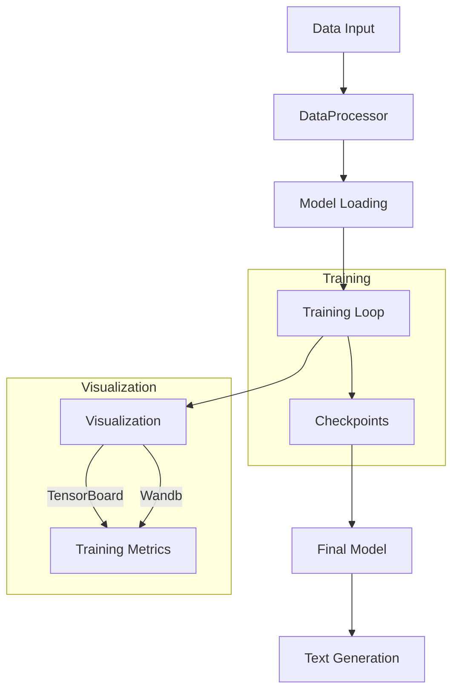

# Language Model Fine-tuning Framework

A robust framework for fine-tuning and evaluating language models with integrated visualization tools.

## Project Structure
```
lm_finetuning/
├── src/
│   ├── __init__.py
│   ├── data_processor.py
│   ├── model_utils.py
│   ├── trainer.py
│   └── visualization.py
├── config/
│   └── __init__.py
├── logs/
│   └── .gitkeep
├── results/
│   └── .gitkeep
├── train.py
├── requirements.txt
└── README.md
```

## Workflow



## Features

- **Flexible Model Support**: Compatible with HuggingFace Transformers models
- **Visualization**: Integrated TensorBoard and Weights & Biases support
- **Checkpoint Management**: Save and resume training sessions
- **Custom Training**: Extended trainer with research metrics
- **Structured Logging**: Comprehensive training metrics and model outputs

## Quick Start

1. Install dependencies:
```bash
pip install -r requirements.txt
```

2. Train a model:
```bash
python train.py --mode train --model distilgpt2 --dataset wikitext --wandb
```

3. Generate text:
```bash
python train.py --mode generate --model_path ./results/final_model --prompt "Once upon a time"
```

## Configuration

### Training Arguments
- `--mode`: train/continue/generate/evaluate
- `--model`: HuggingFace model name
- `--dataset`: Training dataset name
- `--wandb`: Enable W&B logging
- `--continue_from`: Checkpoint path for continuing training

### Generation Arguments
- `--model_path`: Path to trained model
- `--prompt`: Generation prompt
- `--max_length`: Maximum generation length
- `--temperature`: Sampling temperature
- `--top_k`: Top-k sampling parameter
- `--top_p`: Top-p sampling parameter

## Visualization

### Weights & Biases Integration
- Run names follow format: `distilgpt2-20250131-163706`
- Tracks:
  - Training metrics
  - Model architecture
  - Generated samples
  - Attention patterns
  - Embedding space visualization

### TensorBoard Support
- Real-time metric tracking
- Loss curves
- Learning rate schedules
- Text generation samples

## Directory Structure Details

- `src/`: Core implementation modules
  - `data_processor.py`: Dataset handling and preprocessing
  - `model_utils.py`: Model loading and configuration
  - `trainer.py`: Custom training loop implementation
  - `visualization.py`: Visualization and logging utilities
- `config/`: Configuration classes and constants
- `logs/`: TensorBoard logs
- `results/`: Trained models and checkpoints

## Contributing

1. Fork the repository
2. Create a feature branch
3. Commit changes
4. Submit pull request